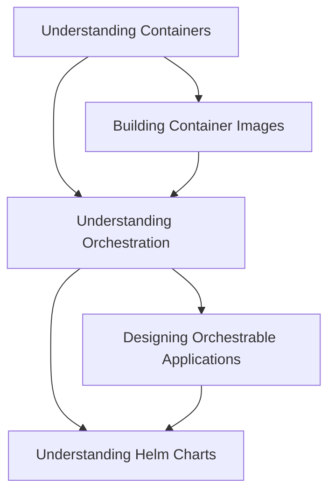

__How to plan your technology foundation?__

Quite simple, just follow the flowchart.
The courses are designed to be building blocks in understanding the devops lifecycle.

For example, if you are a Node.js developer and are looking at building and packaging applications, you would start with signing up for _Understanding Containers_ <Insert code link here>, then learn _Building Container Images_. To learn deploying, you are required to start with _Understanding Orchestration_ and then move to _Designing Orchestratble Applications_ and finally learn _Understanding Helm Charts_.

__If you are not a developer?__

Still, follow the flowchart.
The course flow is planned to help non-developers such as architects, system administrators and anyone managing application deployments.

For example, if you are a system administrator and are required to manage deployment of your in-house or client applications, you would start with _Understanding Containers_, then learn _Understanding Orchestration_ and finally, _Understanding Helm Charts_.

__Why should you choose our trainings?__
* Short, concept-level trainings that you can learn in one or two sittings.
* Practical, industry-relevant examples and code, all open source that you can download and play with.
* Courses carefully designed to help you apply concepts as you learn.

__What sets this set of trainings apart from others?__

* __Going beyond surface level knowledge__ - Our trainings are focused, comprehensive, drill-down at times that can help you avoid common mistakes while working with tools.
* __Version updates and releases are accommodated__ - Our training content is based on official documentation, so we keep up with the version updates.
* __Wider scope for learners to become experts__ - Learning path to specific area of interest is clearly given so that you can pick and choose the tools and technologies that fit your tech needs. 