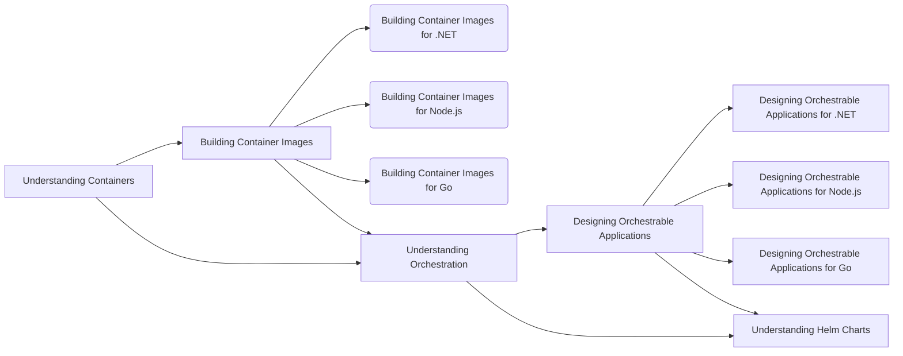

|Course||Duration|
|---|:---:|---:|
|Understanding Containers||4 hours|
|Building Container Images||4 hours|
|Building Container Images for .NET||2 hours|
|Building Container Images for Node.js||2 hours|
|Building Container Images for Go||2 hours|
|Understanding Orchestration||8 hours|
|Designing Orchestrable Applications||4 hours|
|Designing Orchestrable Applications for .NET||2 hours|
|Designing Orchestrable Applications for Node.js||2 hours|
|Designing Orchestrable Applications for Go||2 hours|
|Understanding Helm Charts||2 hours|

How to plan your technology foundation?
Quite simple, just follow the flowchart.
The courses are designed to be building blocks in understanding the devops lifecycle.

For example, if you are a Node.js developer and are looking at building and packaging applications, you would start with signing up for Understanding Containers <Insert code link here>, then learn Building Container Images for Node.js. To learn deploying, you are required to start with Understanding Orchestration and then move to Designing Orchestratble Applications for Node.js and finally learn Understanding Helm Charts.

If you are not a developer?
Still, follow the flowchart.
The course flow is planned to help non-developers such as architects, system administrators and anyone managing application deployments.

For example, if you are a system administrator and are required to manage deployment of your in-house or client applications, you would start with Understanding Containers, then learn Understanding Orchestration and finally, Understanding Helm Charts.

Why should you choose our trainings?

What sets this set of trainings apart from others?