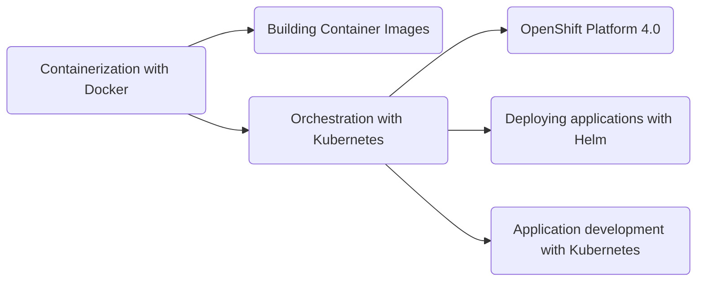
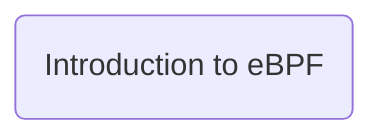

We believe that to use any technology effectively, you have to first understand the motivation (why) behind its creation, and then its basic design (what). This makes understanding the utilisation (how) easy and intuitive. All our training programs are built around these ideas.

We also believe that the best way to learn a technology is to try it as you learn it. Therefore, all our trainings are hands-on. After an initial section where we discuss the motivation and design of any technology, the rest of the training is completely practical.

Our courses are carefully designed to help you understand core concepts, and thus enable you to explore further on your own and apply the learning in your daily business/project needs. The learning is incremental: topics building on previous ones, exercises complementing each other, samples mirroring real-life scenarios. Finally, the courses and exercises are created using our practical experience of the relevant technology, and official product documentation.

## Courses 

We currently offer the following courses:

|Course|Duration|Description|
|---|---|---|
|Containerization with Docker|3 days|This course teaches the concept of containerization as standardized by the OCI, and as implemented by Docker. It covers basic and advanced container concepts, storage and networking, application "stack" management using Compose, and creating custom images.|
|Building Containers Images|2 days|This course introduces the essentials of building container images for creating efficient, secure, and portable containers. It teaches how to write Dockerfiles, manage dependencies, optimize image layers, and use build tools to automate image creation for various application environments. It covers advanced topics such as building multi-platform images, generating SBOMS, and vulnerability evaluation, and provides some practical tips for image versioning, maintainance and documentation.*Participants should know containerization.*|
|Orchestration with Kubernetes|5 days|This course provides an in-depth understanding of Kubernetes core concepts. It explains and demonstrates the distributed nature of Kubernetes, the power and flexibility of the API, and the role of components such as the backing store, controllers, pod, CNI plugins, volumes, provisioners and metrics management. All topics are covered from  admin and developer perspectives, with examples to match. *Participants should know containerization.*|
|OpenShift Platform 4.0|5 days|This course introduces the OpenShift platform, a foundation for building, deploying and managing applications at scale. It explains how OpenShift builds on the Kubernetes base by providing supplementary services for networking, security, storage and other categories. It showcases standard patterns and practices in the OpenShift platform to ensure security, reliability and scalability of applications. *Participants should know Kubernetes.*| 
|Deploying applications with Helm|2 days|This course teaches how to use Helm to create and maintain application packages, or "charts". It covers the design and use of Helm, application and library charts, creating and updating releases, versioning and upgrading and publishing charts to repositories, the Artifact Hub and best practices. *Participants should know Kubernetes.*|
|Introduction to eBPF|3 days|This course introduces the fundamentals of eBPF programming, with a strong emphasis on its applications in network observability and monitoring. It covers key concepts such as writing eBPF programs using libbpf, attaching eBPF programs to kernel events, using maps for data collection, and integrating with tools like BPFtrace and Grafana.*Participants should be developers familiar with C or Go.*|
|Application development with Kubernetes|5 days|This course introduces the principles and practices of building applications that interface with Kubernetes. It teaches how to design, deploy, and manage applications using Kubernetes APIs, configuration patterns, and declarative infrastructure. It also delves into advanced topics such as developing Kubernetes Operators, integrating custom metrics for autoscaling, and extending Kubernetes functionality. *Participants should know Kubernetes.*|

All our courses are designed to benefit developers as well as operations professionals.

## Learning Path

---

## Custom Training

Our courses are designed to allow for customization, based on:

1. The specific objectives of the customer for a given program
2. The profile and experience of the participants

We can design new courses for you as well. Our expertise is in Open Source technologies and programming languages.

## Want more details?

[Contact Us](/contact)
